<h1 style="margin-bottom: 0;">
  
  <span style="position: relative; top: -7px; left: 5px">PoliMap</span>
</h1>

<p style="margin-top: -10px;">
  <strong>Insurance-aware hospital decision support for patients and caregivers in India.</strong>
</p>

Upload your health policy. Find out which hospitals you are covered at, what
room you are entitled to, and what you would actually pay yourself.

Built for *Precision Care Challenge 2026: "Hospitality: Holistic Optimization
System for Policy-Integrated Admission & Treatment Intelligence."*

**Live: [paulimap.vercel.app](https://paulimap.vercel.app)**. The API runs on a
free container instance that sleeps when idle, so the very first request after a
quiet spell takes around a minute to wake it. Everything after that is normal.

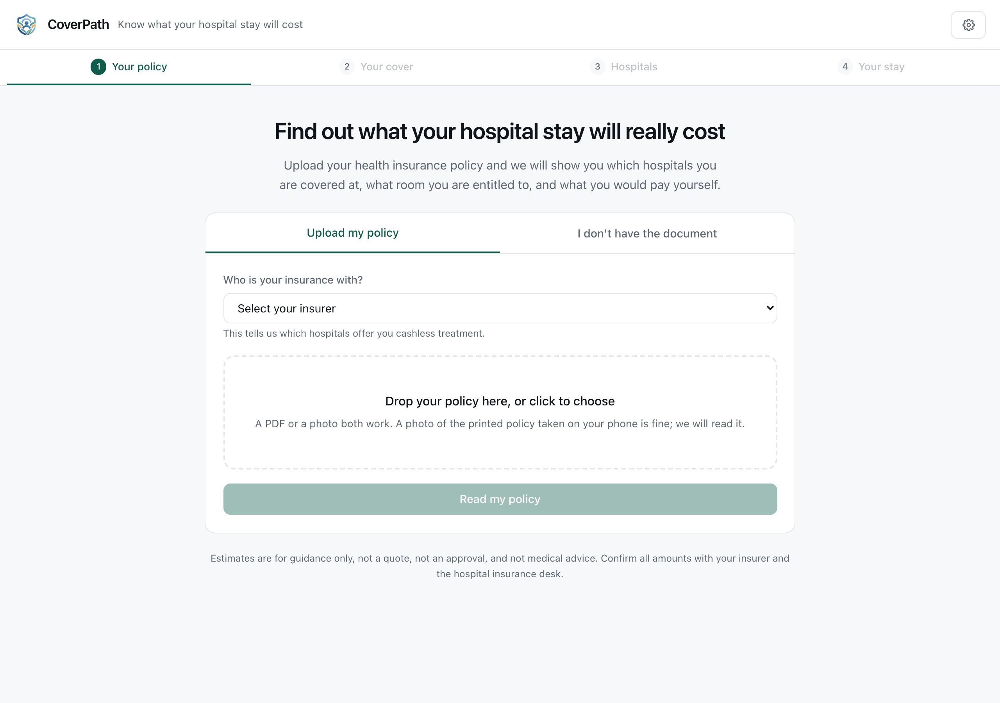

---

## The problem, and the gap

Most people in India hold at least one health cover: private, employer, or a
government scheme like PM-JAY, ESI, Arogya Karnataka or Yeshaswini. During an
admission nobody can answer the questions that actually matter in time. *Which
hospitals am I covered at? What room am I entitled to? What will I have to pay
myself?* The policy, the hospital's tariff and the treatment plan live in three
separate places, and the person holding the policy is the patient.

A system that stops at "extract the fields, filter the hospitals, show a list"
answers *where can I go*. It does not answer **what will this cost me**, which
is the question that causes the financial stress. PoliMap answers that one, in
rupees, with the reasoning shown.

---

## What makes it different

### 1. The proportionate deduction, modelled correctly

Take a room above your eligible category in India and you do not merely pay the
difference in room rent. Your insurer reduces its payout on everything priced by
room tier: surgeon, theatre, nursing. Almost nobody knows this before they are
handed the bill.

The IRDAI master circular of May 2024 narrowed that reduction so it no longer
touches ICU, pharmacy, diagnostics, implants or consumables. Modelling that
boundary is not a detail. Both regimes are implemented, so the difference can be
shown rather than asserted. This is the engine's own output for a ₹5 lakh
policy with a ₹5,000/day room limit, where the patient takes an ₹8,000/day room
on a ₹2,00,000 bill:

|                         | Current rules (post-2024) | Legacy (pre-2024) |
| ----------------------- | ------------------------: | ----------------: |
| Hospital bill           |                ₹2,00,000 |        ₹2,00,000 |
| Room above your limit   |                −₹15,000 |        −₹15,000 |
| Proportionate deduction |                −₹41,250 |        −₹60,000 |
| **Insurer pays**  |      **₹1,43,750** |        ₹1,25,000 |
| **You pay**       |        **₹56,250** |          ₹75,000 |

₹18,750 of difference from one boundary. Under the current rules the deduction
touches only the surgeon's fee, theatre and nursing; under the old rules it
reached medicines too.

Every deduction is shown, named, and traced back to the clause that caused it:

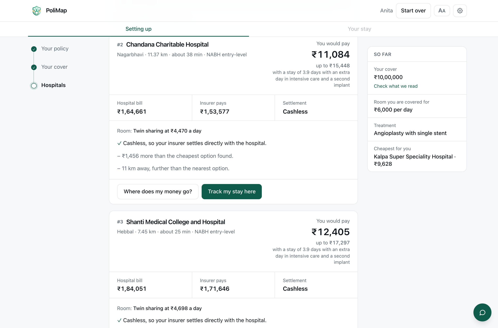

### 2. Extraction that cannot invent a number

A policy is read into a plain summary of what you are covered for:

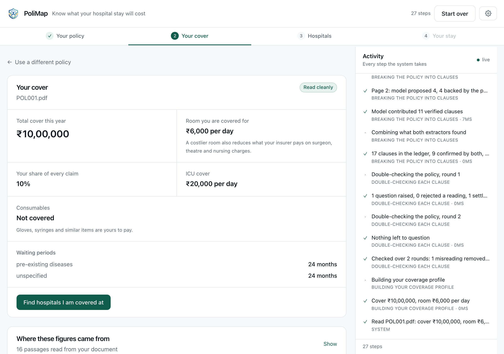

A clause is admissible only if the text it claims to quote can be found in the
page it claims to come from. This is enforced in code, not requested in a
prompt. Matching tolerates OCR damage, folding `O`/`0` and `S`/`5`, while
requiring that a quote's *digits* genuinely appear in the source, because a
misread letter is harmless and an invented figure is not.

So every figure above traces back to the passage it was read from:

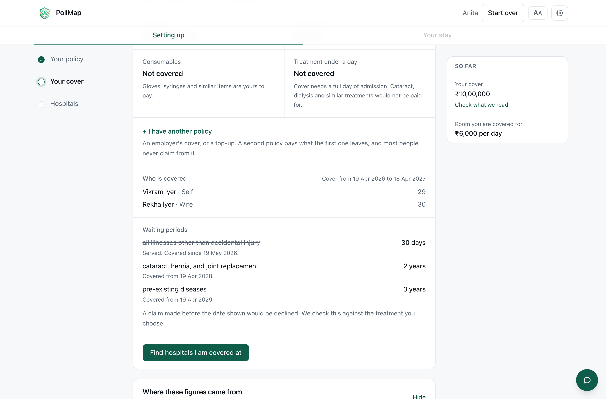

### 3. A rule is read as a rule, not as the numbers in it

Wrong values are the dangerous failure: a missed field prompts a question, and a
confidently incorrect figure prompts nothing. So the model's output is attacked
before it is believed, most sharply by re-parsing each clause's own quote and
confirming it still yields the value reported.

Measured across 160 fields, 10 policies, 6 document conditions:

| Configuration                    |    Accuracy | **Wrong values** | Missing |
| -------------------------------- | ----------: | ---------------: | ------: |
| Rules only                       |       94.4% |                2 |       7 |
| Rules + verification             |       94.4% |                2 |       7 |
| Rules + model                    |       96.9% |                3 |       2 |
| **Rules + model + verification** |   **96.9%** |            **3** |   **2** |

The measurement is worth more than the score, because twice now it has been the
thing that found the bug.

**A limit and its qualifier are one rule.** Two policies here write the room
limit as *"1% of Sum Insured per day, subject to a maximum of Rs. 5,000/- per
day"*. That is one entitlement, worth whichever of the two binds lower against
this policyholder's own cover: ₹3,000 on a ₹3,00,000 policy, where the ₹5,000
never bites. Extraction handed back the percentage and the ceiling as two
clauses, so verification concluded correctly that only one of them could be the
term, and resolved a contradiction that was never there by discarding half the
rule. It kept the ₹5,000 on one policy and the uncapped 2% on the other, wrong
in opposite directions, and a wrong room cap is not a wrong line on a summary:
it sets the proportionate deduction applied to the surgeon, theatre and nursing
charges. The reading is now one shared function that both extractors call, it
knows the vocabulary (*capped at*, *not exceeding*, *whichever is lower*), and a
conservative pass rejoins the halves if they ever arrive apart.

**A photographed table still has rows.** OCR reads a two-column benefit table by
block, so it can return every label and then every value: read as text, "Room
Rent Limit" is followed by "Intensive Care Unit (ICU) Limit", and the schedule
is lost. Searching further down the page is the obvious repair and the wrong
one, because the next figure below the room label *is* the ICU limit. The rows
are rebuilt from the word boxes OCR already produced, and only where reading the
page as text found nothing, so a page that reads correctly cannot be harmed by
it. That alone is most of the rules-only column above.

**What verification is worth, honestly.** Nothing on this corpus, now. It is
exactly neutral in both pairs. It was worth a point when extraction was noisier,
and it is what turns an unresolved conflict into a plain-language question
rather than a silent guess, so it stays. But the row that carries this system is
the grounded reading, not the argument about it.

The three that remain wrong are two consumables flags and one room entitlement
stated as a category with no figure, misread from a dark photograph as a
percentage.

### 4. It never returns an empty page

Every hospital that fails a filter records *why*. When nothing matches,
constraints are relaxed in a stated order, cheapest sacrifice first, and each
relaxation is labelled with its consequence. Travelling further is an
inconvenience; leaving your cashless network means funding the whole bill
upfront, so those are not surrendered in the same breath.

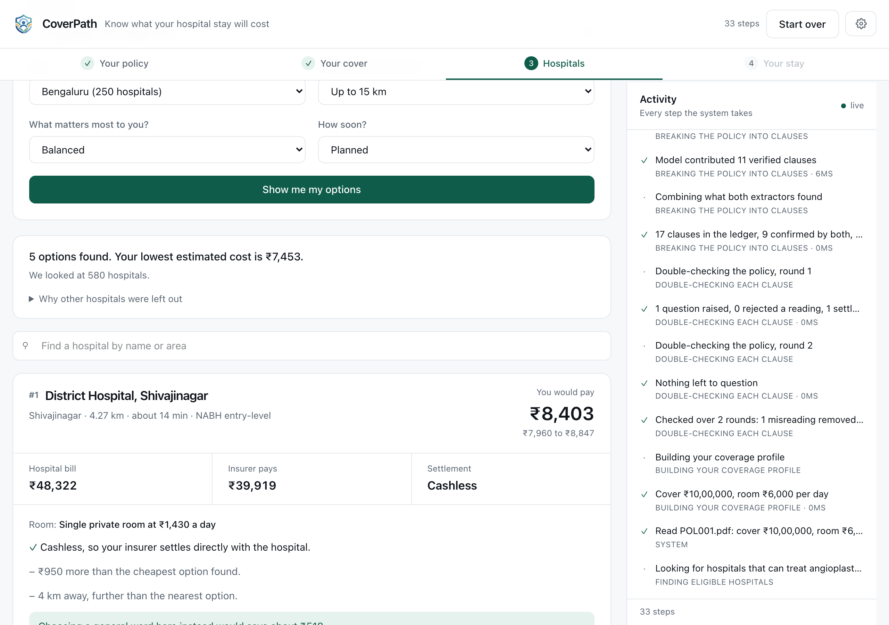

### 5. The journey keeps answering as the stay goes on

An estimate made before admission is stale by day three. Each stage re-runs the
costing against what has actually been billed, and reports the cover remaining.

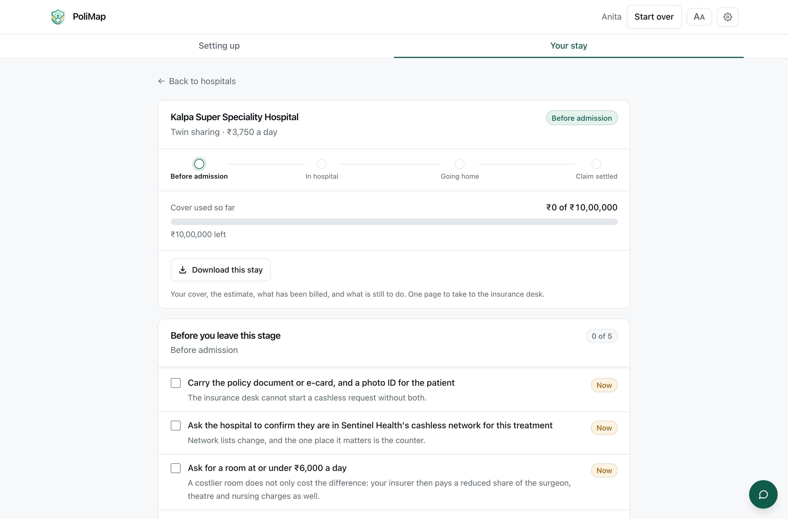

Real admissions do not follow the diagram. People are discharged without a
procedure, go back to investigation after a complication, and update the app
hours after the fact. So the model bends where reality does:

* **Going back is always allowed**, with no confirmation. Correcting a mistake
  should never be harder than making one.
* **Skipping ahead asks first**, and says what is being passed over. The notice
  is deliberately quiet: the person reading it may be in a hospital corridor,
  and nothing about it is an error.
* **Why they skipped is theirs to give**, behind a checkbox, never required.

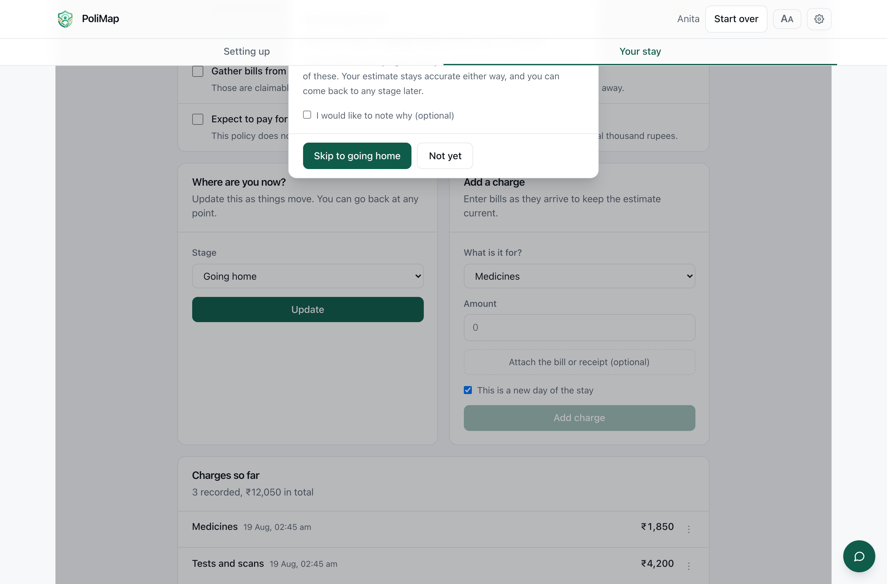

Charges are entered in a hurry, at a billing counter, which means some of them
are entered wrong. Every one can be corrected or removed, and a photograph of
the bill can be attached at the moment it is in your hand rather than hunted
for weeks later at claim time.

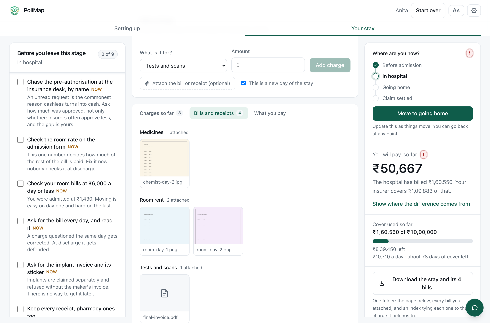

### 6. The final bill, checked line by line

Discharge is the worst moment to read a bill for the first time, and it is the
only moment most people get. A fair number of lines on one are negotiable, and
the ones that are follow rules anybody can check. Photograph the itemised bill
and it comes back read:

* **Items billed twice for one thing.** The IRDAI schedule places gowns, blades,
  dressings and admission kits *inside* the room or procedure charge. Billed
  separately, they are the same charge twice, and the billing desk will correct
  it. This is the part almost nobody knows.
* **Items no policy pays**, separated from the above, because one is money to
  ask for back and the other was always yours.
* **Lines that do not multiply out**, and lines that do not add up to the total.
* **The deduction that is not on the bill at all**: the room cap and its
  knock-on across room-linked heads, which the insurer takes at settlement and
  the hospital never mentions.

Each finding carries the rupees, the lines, and one sentence to say out loud.
Nothing accuses anybody: billing is done at speed by people with several hundred
lines to enter, and "could you check this line" gets a bill corrected where an
accusation gets a supervisor.

Arithmetic findings are gated on whether the document read cleanly. The printed
total is a checksum over the lines, so a photograph that reproduces it was read
correctly whatever the recognition score says, and one that does not is told so
rather than handed a fifty thousand rupee discrepancy that exists only in our
reading.

The settlement underneath is the same waterfall the estimate used, so a family
quoted one figure before admission and handed another at discharge can see which
line moved.

### 7. It speaks the language it is read in

The interface is available in English, Kannada, Hindi, Marathi and Telugu.
Every word it writes itself: 770 keys, each resolving in all five. Not
translated, deliberately: anything read out of somebody's policy. A clause
paraphrased into another language and shown as what the document says is a claim
about their cover that nobody has checked.

Call sites pass the English beside the key, so a missing translation renders
English rather than a raw key. That fallback is invisible on screen, which is
exactly how a language rots back into English one key at a time, so a check runs
with the linter and fails the build on any key that does not resolve in every
language, or any translation no call site can reach.

Sentences take their values as placeholders rather than by concatenation,
because the order a figure and its noun appear in is not the same in every one
of these languages. Enum labels arrive from the server in English beside their
value, so rooms, settlement modes, expense heads and stages are keyed on the
value and read in the reader's language; the same check mirrors those enums, so
adding one server-side without a translation fails the build.

Each language is its own file, fetched when somebody chooses it. Held together
they were the larger part of what every visitor downloaded, four fifths of it a
script that reader will never see; separated, the interface arrives at the
weight of one language and English costs nothing at all.

Some of what this app says can only be composed on the server, because that is
where the policy and the bill are: "your room is ₹8,000 a day and you are
covered for ₹5,000" is a sentence about two numbers that only exist after
adjudication. Those sentences carry three things rather than one, the key that
says which sentence it is, the English as composed, and the values written into
it, and the reader's own language is looked up under the key with the numbers
put back into it there. Two kinds of value cannot survive that on their own and
travel twice: a waiting period goes as a unit and a count rather than as "24
months", and a date goes in ISO form beside the written one, because "17
November" is an English month wherever it has been dropped into a sentence and
no table can reach inside a value.

Those keys are written in Python, so the frontend check cannot find them; they
are declared to it instead. The other half of that check runs from the side they
are born on, exercising the paths that produce them and failing with the key and
the language named when one has no line.

The panel a person watches while their policy is read is the same story from the
other side. Its five phase names were constants and are keys now, but the line
underneath, the one naming the file being opened or the page being recognised,
is the server's own summary and cannot be translated where it stands. So it is
composed in the browser instead, out of the figures the same event already
carries, and a step that has not produced its figures yet says nothing rather
than something half true.

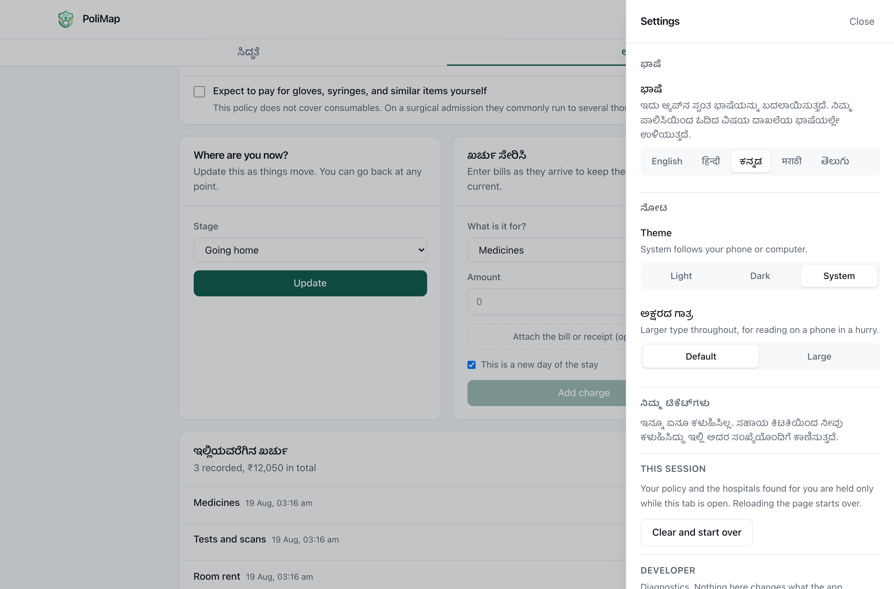

### 8. A help desk that answers and files, and can do nothing else

In the corner of whatever you are already doing, because the question is nearly
always about what is on the screen: whose name goes in this field, which of
these rooms, what is this deduction. Sending somebody to a help page to ask
about the page they were on is how help stops being used.

It cannot change anything, and that is structural rather than a matter of
prompting. There is no path from the help desk into a session, and the route is
not even given a session id: not being handed somebody's policy is a stronger
guarantee than being trusted not to read it. Everything in this app is what a
claim gets estimated from, so it stays in the user's hands.

Every answer is written in this repository, in `help/knowledge.yaml`. With no
model reachable the knowledge base answers on its own by matching what was
asked; with one, that same knowledge is the only ground the model is given, so
the difference between the two paths is fluency rather than substance.

It answers in the language it was asked in, and in the script it was asked in.
Those are two questions, and the second one is where a model left to itself gets
it wrong: shown "room rent ka limit kitna hai" it recognises the Hindi and
answers in Devanagari, to somebody who was typing in English letters. The script
is decided here instead, by counting the letters of the question, which settles
it exactly and covers the way most of this country actually types. Everything
the desk did not write on the spot, the opening, the refusals and the fourteen
written answers, travels with the key it is read under, so those come back in
the reader's language with no model involved at all.

The answer arrives as it is written rather than several seconds later, all at
once. The vetting below is not relaxed for that: every check made on a finished
draft is made on the growing one, and nothing reaches the screen until two
hundred characters sit behind it, so a rule that a sentence is about to trip
trips before that sentence has been shown to anybody. The finished reply is sent
whole at the end and is the one that counts; when a draft is stopped part way,
it carries the written answer and the browser replaces what it had.

The answers and the refusals are YAML rather than Python because they are text
and patterns, not logic. Every answer the desk can give, and every question it
turns away, can be read end to end in two files without reading any code, and
changing one cannot break the matching around it. Both are loaded with
`safe_load`: YAML's full loader instantiates arbitrary objects named in a
document, and a knowledge base is exactly the kind of file that gets edited
casually.

Four things are refused before any model sees them:

- **Anything clinical.** Sent to the treating doctor, where it belongs.
- **Anything asking what an insurer will decide.** Only the insurer can decide a
  claim; the app can only show what the policy says.
- **Anything asking the desk to act.** It says so plainly and points at where
  the user can do it themselves.
- **Anything after somebody's data**, the system prompt, or a key. There is
  nothing to fetch, and saying so beats letting a model improvise about data it
  cannot see.

Getting that filter right took two passes. The first version refused "whose name
should I enter", which is the single question the desk most exists to answer,
because it read the shape of the question rather than its subject.

A drafted answer is checked on the way out as well. The payoff of a successful
injection is not the model being rude, it is a link or a phone number for
somebody in a hospital to act on, so a draft carrying one is dropped, along with
a draft that recites its instructions or claims to have changed something.
Dropped, not edited: text that has been steered somewhere cannot be repaired by
deleting the evidence of it, and the fallback is the written answer, so the
worst case is a duller reply rather than a wrong one.

Nothing is kept. Closing it, starting a new chat or changing name loses the
conversation, which is the honest behaviour when there is nowhere private to put
a transcript that names a hospital and a treatment.

Feedback and problems become tickets with a reference to quote, tracked under
Settings. The tracker shows the first stage and says plainly that nothing is
working on it, because there is no support desk behind this app and a status bar
that crept along on its own would be the one dishonest thing in it.

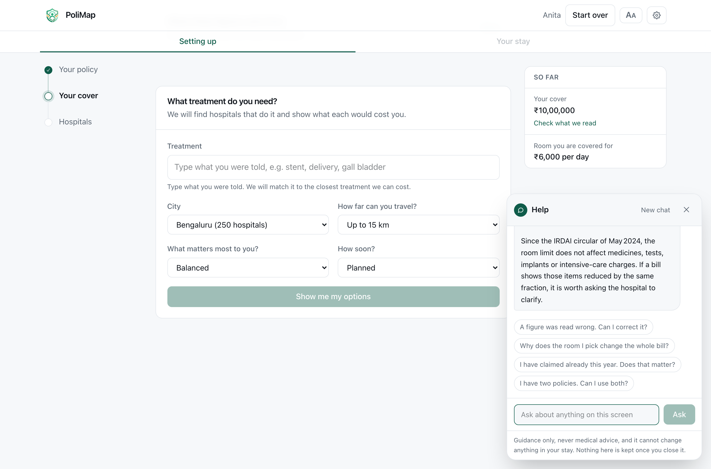

---

## Running it

**One-time setup**

```bash
brew install tesseract              # OCR engine (apt: tesseract-ocr)

python3 -m venv .venv
.venv/bin/pip install -r backend/requirements.txt

cp backend/.env.example backend/.env    # then paste your OLLAMA_API_KEY into it

.venv/bin/python -m datagen.build_all   # full corpus, about two minutes
# or: .venv/bin/python -m datagen.build_all --core   # just the app's data, half a second
```

**Run it, two terminals**

```bash
# Terminal 1: API
cd backend && ../.venv/bin/python -m uvicorn app.main:app --reload --port 8000

# Terminal 2: web interface
cd frontend && npm install && npm run dev
```

Then open **http://localhost:5173**.

Upload any policy from `data/generated/policies/`. Try `clean/POL001.pdf` for
the clean path, or `scanned/POL003_phone_photo.pdf` to watch the OCR ladder and
vision escalation work on a photographed document.

It runs without an API key. With no model reachable it uses the deterministic
extractor alone, and says so rather than pretending.

**Verifying it**

```bash
cd backend && ../.venv/bin/python -m pytest -q     # 1056 tests

.venv/bin/python -m ruff check .                   # lint, whole repository
cd frontend && npm run lint                        # includes: every interface
                                                   # string resolves in all
                                                   # five languages

.venv/bin/python -m bench.ocr_bench                # intake quality by condition

# The ablation table above, in the order it is printed. --limit 10 is the
# sample it was measured on; without it the run covers all 40 policies.
.venv/bin/python -m bench.extract_bench --limit 10
.venv/bin/python -m bench.extract_bench --limit 10 --no-verify
.venv/bin/python -m bench.extract_bench --limit 10 --no-model
.venv/bin/python -m bench.extract_bench --limit 10 --no-model --no-verify
```

`curl localhost:8000/api/health/providers` shows which model is serving each
role on your account.

---

## The pipeline

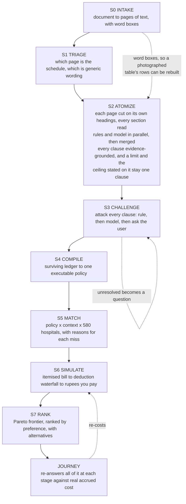

Every step emits a `PipelineEvent` written to the server log *and* streamed to
the browser, so what the user sees cannot drift from what the server did. Two
things read that stream. The person waiting on their policy gets the five phases
it groups into, with the page count and the timings, which is the whole of what
they want to know. The activity panel gets every step, and it is a developer's
window rather than a setting: it is asked for in the address bar with
`?activity=1`, which is where the people who want it look and nowhere the people
who do not will trip over it.

Settings carries what belongs to the reader and nothing else, and is reachable
from the very first screen, because the language control is inside it and
somebody who cannot read the sign-in page has to be able to get to it before
they are asked to type anything:

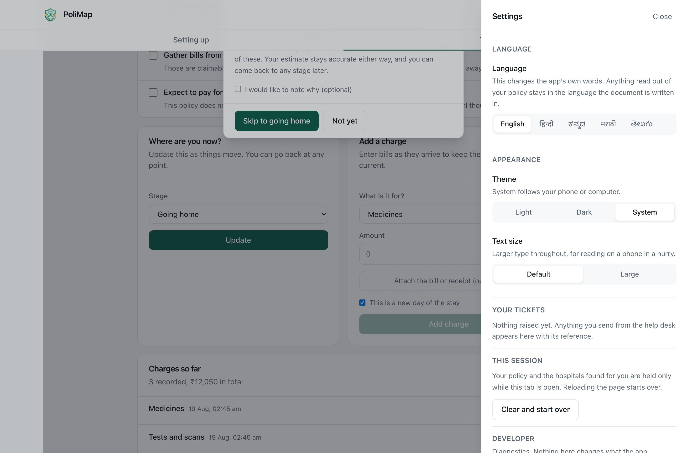

Type is set in rem throughout and the whole app has a dark theme, because it
gets read on a phone, at night, by someone who is tired.

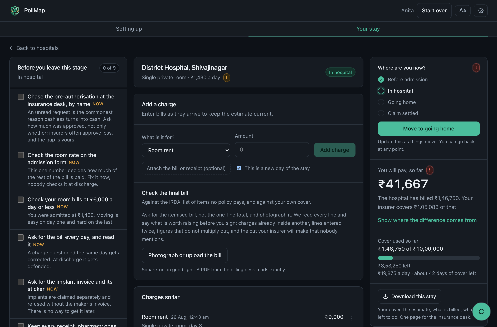

**Intake ladder**, cheapest rung first: native text layer, then Tesseract, then
a vision model, then ask the user. Preprocessing branches on measured page
condition. Speckle detection picks a median filter over non-local means,
lighting is flattened only when a shadow is actually present, and capture DPI is
inferred from page dimensions. Field recall across all 104 documents:
**96.4%**, up from 81.3% before those three fixes.

---

## The data

Synthetic, per the problem statement's mandate, but generated from real anchors.

|                |     |                                                        |
| -------------- | --: | ------------------------------------------------------ |
| Procedures     | 126 | CGHS-anchored package rates, NABH vs non-NABH          |
| Hospitals      | 580 | Bengaluru 250, Delhi NCR 120, Mumbai 120, Hyderabad 90 |
| Insurers       |  18 | 10 invented companies and 8 government schemes         |
| Policies       |  40 | rendered as 104 documents, each with ground truth      |
| Hospital bills |  20 | 27 documents, every line and planted fault known       |

Hospital attributes are *correlated*, not drawn independently: size drives
accreditation odds and specialty breadth, locality drives tariffs, and both
drive how many insurers sign a cashless tie-up. That is what gives matching real
trade-offs. The cheap hospital genuinely tends to be the one outside your
network without an ICU, which is the decision a family actually faces.

The bill corpus exists so the checker can be reported as a number rather than
demonstrated on a screenshot. Bills are generated from the same tariffs the
estimator uses, and carry planted faults drawn from what billing desks actually
do: an item billed separately that belongs inside another charge, a line entered
twice, a quantity against the wrong rate, a printed total that does not match
the lines. A quarter of them carry no fault at all, because precision matters as
much as recall here: a checker that finds something wrong with every bill is one
nobody believes the second time. On the clean documents it reads every line,
places every head, gets every total exact, finds all 27 planted faults, and
raises nothing that was not planted.

The policy corpus is adversarial by design. The same room limit appears as a
flat amount, a percentage of cover, a percentage capped by a maximum, a room
category with no figure, and as no limit at all. Amounts are written as
`Rs. 5,00,000`, `INR 5,00,000`, `₹5,00,000` and `5.00 Lakhs`. Premium and GST
sit directly below the sum insured, because grabbing the premium is the
commonest extraction error. Three policies contradict themselves between
schedule and wording. 52% of documents carry no text layer at all.

Insurer names are invented. Attaching fabricated networks and tariffs to real
companies would be misleading.

---

## Deploying it

The frontend is a static bundle and goes anywhere. The API is a container,
because reading a photographed policy needs the Tesseract binary, which no
Python wheel provides and no serverless Python runtime offers. That single fact
decides the shape of the deployment.

|          | Where                                       | Why                                             |
| -------- | ------------------------------------------- | ----------------------------------------------- |
| Frontend | Vercel, Netlify, any static host            | Plain Vite build                                |
| API      | Render, Railway, Fly.io, any container host | Needs Tesseract, and holds SSE connections open |

```bash
# API
docker build -f backend/Dockerfile -t polimap-api .
docker run -p 8000:8000 --env-file backend/.env polimap-api

# Frontend
cd frontend && VITE_API_BASE=https://your-api-host npm run build
```

Two settings have to agree or nothing works: `VITE_API_BASE` tells the browser
where the API is, and `CORS_ORIGINS` on the API tells it to accept that origin.

Full walkthrough, including the Vercel steps and what to watch out for:
**[docs/DEPLOYMENT.md](docs/DEPLOYMENT.md)**.

The running deployment is the frontend at
[paulimap.vercel.app](https://paulimap.vercel.app) talking to the API container
on Render.

### State

There are no accounts yet, so the browser is deliberately given nothing to
remember: **reloading the page starts over.** Session state lives on the server
in SQLite for as long as the tab is open, which is what lets a document that
took a minute to read survive a restart of the API and lets more than one
worker serve the same user. Accounts, and with them sessions that persist on
purpose, are the next thing this needs.

Nothing is kept longer than it is useful. Sessions expire after
`SESSION_TTL_MINUTES` (12 hours by default). Page images from uploaded
documents, and any bill photographs attached to charges, are deleted when a
session ends and swept at startup once past that lifetime. "Clear and start
over" in settings removes them immediately. These are pictures of someone's
insurance paperwork, so this is a privacy question as much as a disk one.

### Continuous integration

[`.github/workflows/ci.yml`](.github/workflows/ci.yml) runs on every push and
pull request:

- **Backend** installs Tesseract, lints with ruff, builds the corpus (cached on
  the generator's own source, since it is deterministic) and runs the tests.
- **Frontend** installs from the lockfile with `npm ci`, lints and builds.
- **API image** builds the Dockerfile and curls `/api/health` to prove the
  container actually serves, which is the thing that really breaks a deploy.

No API key is set in CI on purpose. With no model reachable the app runs its
deterministic path, which is a supported mode, so CI never spends money or fails
because a provider is having a bad day.

---

## What is walled off

There is no account and no password anywhere in this app, on purpose: a family
in a hospital at two in the morning should not have to invent one. That makes
everything else here load-bearing, so it was tested against a running server
rather than reasoned about.

**What one upload may ask for.** Reading a policy rasterises every page, runs
OCR on each and then makes several model calls, and none of it was bounded. A
20 KB file declaring 120 blank pages held every core on the machine at 638% CPU
for over two minutes and carried on after the client gave up. A one kilobyte
file can declare a page 200 inches square, which at 300 DPI asks for a 60000 by
60000 pixel image: eleven gigabytes. There are ceilings on both now. An A0 scan
is a real thing somebody photographs, so an oversized page gives up resolution
rather than being refused; a page the size of a wall is refused, because no
resolution both fits the ceiling and leaves anything readable. An image's
dimensions are read from its header before it is decoded.

**How often.** A token bucket per caller, priced by what the route costs:
reading a document is strict, the help desk gets its own allowance because it is
a conversation, and recording a charge is an ordinary write. That last one
matters. An earlier pass priced charges as expensive, and a caregiver entering
the day's charges at a counter would have met the ceiling with the day half
entered. The pricing is checked against a whole journey run end to end, not
against what is easy to classify.

**How large.** The body cap is applied before the body is read. A 200 MB upload
used to be spooled to disk in full and then refused; it is now refused with
nothing on the wire. Anything that is not multipart is held to a megabyte,
because a large JSON body is not an upload, it is work for the parser.

**The session id.** It is the whole of the access control, and it was twelve hex
characters. It is 192 bits from `secrets` now, and checked for shape before it
reaches a store or a filesystem path, so a traversal attempt is refused for
what it looks like rather than by the accident of finding no such session. A
missing session and a malformed one answer identically: the difference would be
a hint about how to guess better.

**The page.** Served under a content security policy that permits no inline
script at all. The one script that was inline, which sets the theme before first
paint, is a file for that reason. The bundle contains no `eval`, so
`unsafe-eval` is not needed either. The API returns its own policy of
`default-src 'none'` alongside nosniff, a denied frame, and no referrer.
Uploaded receipts are served as attachments with sniffing off, so an HTML page
wearing a `.png` suffix cannot become a page running on the API's origin.

**The help desk.** It is the one place a person's own words reach a model, and
the guarantee that matters there is structural rather than a pattern: it is
handed no session, no policy and no document, and its route takes no session
id. A question asking for somebody's cover is being asked of a process that
does not have it. Around that, questions are screened before any model call and
drafts are screened after: a draft carrying a link, a phone number, its own
instructions, or a claim to have changed something is dropped rather than
edited, because text that has been steered cannot be repaired by removing the
evidence of it.

Two leaks turned up while writing the tests for the above, both worth naming
because neither was where anybody was looking. The API key was printed in full
by any traceback holding the settings object, which is how it reached a pytest
assertion and would have reached a public CI log. And exception text was being
streamed to the browser as an activity event, carrying temporary file paths and
library internals; the type names the failure now, and the message stays in the
log.

All of it is in `backend/tests/test_protection.py`, one test per hole, because
the failure mode of a wall is silence: nothing looks different when one stops
working, right up until somebody walks through it.

---

## Scope

This is a decision-support and information tool. It does not diagnose, does not
recommend treatment, and does not give binding insurance advice. Journey stages
are administrative, describing where the paperwork stands, and nothing in the
system records or reasons about a diagnosis. Every figure is an estimate and is
labelled as one.

---

## Layout

```
backend/app/
  pipeline/     s0_intake through s7_rank, plus run.py for the whole chain
  agents/       provider-agnostic model layer with role-based fallback chains
  schemas/      the domain contracts
  journey/      care journey tracking
  bill/         reading a hospital bill and checking it
  help/         the help desk: knowledge.yaml, guardrails.yaml, and the
                two modules that read them
  report/       the stay as one printable page
  core/         config, telemetry bus, guardrails, rate limits, the HTTP
                walls, artifact cleanup
  api/          HTTP surface, session store, the SSE activity stream
datagen/        corpus builders
bench/          OCR and extraction benchmarks
frontend/       React, Vite and Tailwind
docs/           deployment guide and screenshots
```

Models are addressed by *role*, never by name: extract, challenge, adjudicate,
vision, narrate. Each role has a fallback chain probed at boot, so a plan change
or a deprecated model degrades gracefully instead of breaking.

It works on a phone, which is where a hospital corridor tends to put you, and
the phone is treated as its own screen rather than a narrow desk:

- **Every control is sixteen pixels until there is a pointer.** Safari zooms the
  whole page in when a smaller field is focused and leaves it zoomed. It is the
  most irritating thing a form can do on a phone, and it is a font size.
- **Nothing is pinned to the bottom in `vh`.** The home indicator sits over the
  bottom of the screen and the browser's own chrome comes and goes as you
  scroll, so `vh` is measured against a viewport that is often not there.
- **The setup flow's thread lies on its side** under the header, and the rail
  is desk-only rather than squeezed in.
- **Wide content scrolls inside itself**, so no table can push the page sideways.

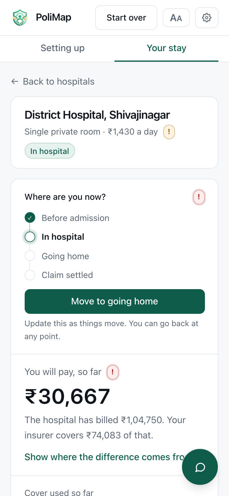

---

## Known gaps

Stated rather than hidden.

- **A photographed bill in bad conditions reads poorly.** A dense priced table
  is far harder than a policy schedule: on the corpus's degraded profiles, dark
  photographs and photocopies, most lines are lost or misread. The checker
  refuses to argue arithmetic from a read that does not reconcile against the
  bill's own total, so it says so instead of inventing a discrepancy, but a
  photograph taken in a dark corridor still gets you less than the PDF the
  billing desk can email.
- **Localisation covers the interface, not the guidance the server composes.**
  Navigation, stage names, the bill check and the disclaimer are translated. The
  checklist's reasons, the alerts and the waterfall's explanations are English,
  and fall back to it silently.
- **The four translations have not been read by a native speaker.** They are
  written carefully and the mechanism is checked, but insurance vocabulary in
  Kannada and Telugu deserves a second pair of eyes before anybody relies on it.
- **Tickets do not go anywhere.** The help desk mints a reference and the
  browser keeps it. There is no support desk behind this app, so a ticket stays
  at received and the tracker says so rather than implying a queue.
- **The help desk is only as good as its knowledge base.** It answers from what
  is written in this repository and says it does not know the rest, which is the
  safe failure but still a failure: a question it has no entry for gets an offer
  to pass it on rather than an answer.
- **Proportionate deduction rarely appears in search results**, because the
  matcher deliberately picks a room *under* your cap. It shows up in the
  counterfactual on each option and in the journey, which is where a room above
  the cap actually gets chosen.
