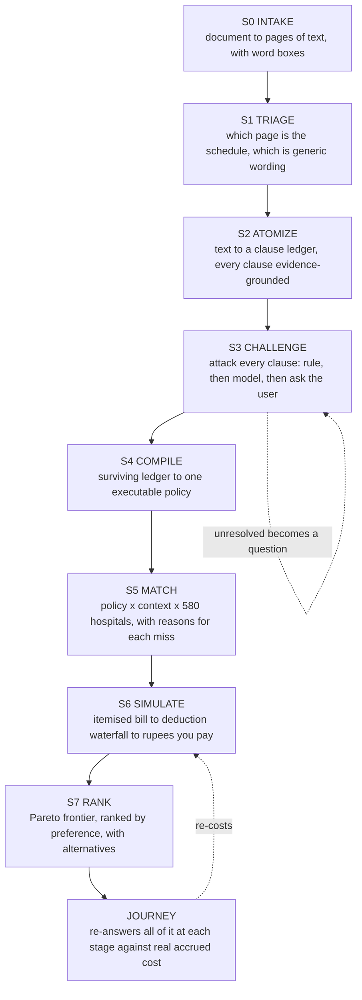

#  PoliMap

**Insurance-aware hospital decision support for patients and caregivers in India.**

Upload your health policy. Find out which hospitals you are covered at, what
room you are entitled to, and what you would actually pay yourself.

Built for *Precision Care Challenge 2026: "Hospitality: Holistic Optimization
System for Policy-Integrated Admission & Treatment Intelligence."*

**Live: [paulimap.vercel.app](https://paulimap.vercel.app)** — the API runs on a
free container instance that sleeps when idle, so the very first request after a
quiet spell takes around a minute to wake it. Everything after that is normal.


---

## The problem, and the gap

Most people in India hold at least one health cover: private, employer, or a
government scheme like PM-JAY, ESI, Arogya Karnataka or Yeshaswini. During an
admission nobody can answer the questions that actually matter in time. *Which
hospitals am I covered at? What room am I entitled to? What will I have to pay
myself?* The policy, the hospital's tariff and the treatment plan live in three
separate places, and the person holding the policy is the patient.

A system that stops at "extract the fields, filter the hospitals, show a list"
answers *where can I go*. It does not answer **what will this cost me**, which
is the question that causes the financial stress. PoliMap answers that one, in
rupees, with the reasoning shown.

---

## What makes it different

### 1. The proportionate deduction, modelled correctly

Take a room above your eligible category in India and you do not merely pay the
difference in room rent. Your insurer reduces its payout on everything priced by
room tier: surgeon, theatre, nursing. Almost nobody knows this before they are
handed the bill.

The IRDAI master circular of May 2024 narrowed that reduction so it no longer
touches ICU, pharmacy, diagnostics, implants or consumables. Modelling that
boundary is not a detail. Both regimes are implemented, so the difference can be
shown rather than asserted. This is the engine's own output for a ₹5 lakh
policy with a ₹5,000/day room limit, where the patient takes an ₹8,000/day room
on a ₹2,00,000 bill:

| | Current rules (post-2024) | Legacy (pre-2024) |
|---|---:|---:|
| Hospital bill | ₹2,00,000 | ₹2,00,000 |
| Room above your limit | −₹15,000 | −₹15,000 |
| Proportionate deduction | −₹41,250 | −₹60,000 |
| **Insurer pays** | **₹1,43,750** | ₹1,25,000 |
| **You pay** | **₹56,250** | ₹75,000 |

₹18,750 of difference from one boundary. Under the current rules the deduction
touches only the surgeon's fee, theatre and nursing; under the old rules it
reached medicines too.

Every deduction is shown, named, and traced back to the clause that caused it:


### 2. Extraction that cannot invent a number

A policy is read into a plain summary of what you are covered for:


A clause is admissible only if the text it claims to quote can be found in the
page it claims to come from. This is enforced in code, not requested in a
prompt. Matching tolerates OCR damage, folding `O`/`0` and `S`/`5`, while
requiring that a quote's *digits* genuinely appear in the source, because a
misread letter is harmless and an invented figure is not.

So every figure above traces back to the passage it was read from:


### 3. An adversarial verification loop, because the measurement demanded one

Adding a language model to extraction halved the missed fields and **tripled the
confidently wrong ones**. Wrong values are the dangerous failure: nothing
prompts anyone to check them. So the model's output is attacked before it is
believed, most sharply by re-parsing each clause's own quote and confirming it
still yields the value reported.

Measured across 158 fields, 10 policies, 6 document conditions:

| Configuration | Accuracy | **Wrong values** | Missing |
|---|---:|---:|---:|
| Rules only | 93.4% | 2 | 10 |
| Rules + model | 93.0% | 6 | 5 |
| Rules + verification | 94.3% | 1 | 8 |
| **Rules + model + verification** | **94.9%** | **3** | **5** |

Verification is what makes the model layer safe to use: it keeps the recall gain
and halves the wrong values the model introduced. Whatever it cannot settle
becomes a plain-language question rather than a silent guess.

### 4. It never returns an empty page

Every hospital that fails a filter records *why*. When nothing matches,
constraints are relaxed in a stated order, cheapest sacrifice first, and each
relaxation is labelled with its consequence. Travelling further is an
inconvenience; leaving your cashless network means funding the whole bill
upfront, so those are not surrendered in the same breath.


### 5. The journey keeps answering as the stay goes on

An estimate made before admission is stale by day three. Each stage re-runs the
costing against what has actually been billed, and reports the cover remaining.


Real admissions do not follow the diagram. People are discharged without a
procedure, go back to investigation after a complication, and update the app
hours after the fact. So the model bends where reality does:

* **Going back is always allowed**, with no confirmation. Correcting a mistake
  should never be harder than making one.
* **Skipping ahead asks first**, and says what is being passed over. The notice
  is deliberately quiet: the person reading it may be in a hospital corridor,
  and nothing about it is an error.
* **Why they skipped is theirs to give**, behind a checkbox, never required.


Charges are entered in a hurry, at a billing counter, which means some of them
are entered wrong. Every one can be corrected or removed, and a photograph of
the bill can be attached at the moment it is in your hand rather than hunted
for weeks later at claim time.


---

## Running it

**One-time setup**

```bash
brew install tesseract              # OCR engine (apt: tesseract-ocr)

python3 -m venv .venv
.venv/bin/pip install -r backend/requirements.txt

cp backend/.env.example backend/.env    # then paste your OLLAMA_API_KEY into it

.venv/bin/python -m datagen.build_all   # full corpus, about two minutes
# or: .venv/bin/python -m datagen.build_all --core   # just the app's data, half a second
```

**Run it, two terminals**

```bash
# Terminal 1: API
cd backend && ../.venv/bin/python -m uvicorn app.main:app --reload --port 8000

# Terminal 2: web interface
cd frontend && npm install && npm run dev
```

Then open **http://localhost:5173**.

Upload any policy from `data/generated/policies/`. Try `clean/POL001.pdf` for
the clean path, or `scanned/POL003_phone_photo.pdf` to watch the OCR ladder and
vision escalation work on a photographed document.

It runs without an API key. With no model reachable it uses the deterministic
extractor alone, and says so rather than pretending.

**Verifying it**

```bash
cd backend && ../.venv/bin/python -m pytest -q     # 400 tests

.venv/bin/python -m ruff check .                   # lint, whole repository

.venv/bin/python -m bench.ocr_bench                # intake quality by condition
.venv/bin/python -m bench.extract_bench            # extraction accuracy
.venv/bin/python -m bench.extract_bench --no-model # ablation: rules only
.venv/bin/python -m bench.extract_bench --no-verify # ablation: no verification
```

`curl localhost:8000/api/health/providers` shows which model is serving each
role on your account.

---

## The pipeline



Every step emits a `PipelineEvent` written to the server log *and* streamed to
the browser's activity panel, so what the user sees cannot drift from what the
server did. The panel is a developer tool, so it lives in settings and is off by
default:


Type is set in rem throughout and the whole app has a dark theme, because it
gets read on a phone, at night, by someone who is tired.


**Intake ladder**, cheapest rung first: native text layer, then Tesseract, then
a vision model, then ask the user. Preprocessing branches on measured page
condition. Speckle detection picks a median filter over non-local means,
lighting is flattened only when a shadow is actually present, and capture DPI is
inferred from page dimensions. Field recall across the corpus: **94.3%**, up
from 81.3% before those three fixes.

---

## The data

Synthetic, per the problem statement's mandate, but generated from real anchors.

| | | |
|---|---:|---|
| Procedures | 126 | CGHS-anchored package rates, NABH vs non-NABH |
| Hospitals | 580 | Bengaluru 250, Delhi NCR 120, Mumbai 120, Hyderabad 90 |
| Insurers | 18 | 10 invented companies and 8 government schemes |
| Policies | 40 | rendered as 104 documents, each with ground truth |

Hospital attributes are *correlated*, not drawn independently: size drives
accreditation odds and specialty breadth, locality drives tariffs, and both
drive how many insurers sign a cashless tie-up. That is what gives matching real
trade-offs. The cheap hospital genuinely tends to be the one outside your
network without an ICU, which is the decision a family actually faces.

The policy corpus is adversarial by design. The same room limit appears as a
flat amount, a percentage of cover, a percentage capped by a maximum, a room
category with no figure, and as no limit at all. Amounts are written as
`Rs. 5,00,000`, `INR 5,00,000`, `₹5,00,000` and `5.00 Lakhs`. Premium and GST
sit directly below the sum insured, because grabbing the premium is the
commonest extraction error. Three policies contradict themselves between
schedule and wording. 52% of documents carry no text layer at all.

Insurer names are invented. Attaching fabricated networks and tariffs to real
companies would be misleading.

---

## Deploying it

The frontend is a static bundle and goes anywhere. The API is a container,
because reading a photographed policy needs the Tesseract binary, which no
Python wheel provides and no serverless Python runtime offers. That single fact
decides the shape of the deployment.

| | Where | Why |
|---|---|---|
| Frontend | Vercel, Netlify, any static host | Plain Vite build |
| API | Render, Railway, Fly.io, any container host | Needs Tesseract, and holds SSE connections open |

```bash
# API
docker build -f backend/Dockerfile -t polimap-api .
docker run -p 8000:8000 --env-file backend/.env polimap-api

# Frontend
cd frontend && VITE_API_BASE=https://your-api-host npm run build
```

Two settings have to agree or nothing works: `VITE_API_BASE` tells the browser
where the API is, and `CORS_ORIGINS` on the API tells it to accept that origin.

Full walkthrough, including the Vercel steps and what to watch out for:
**[docs/DEPLOYMENT.md](docs/DEPLOYMENT.md)**.

The running deployment is the frontend at
[paulimap.vercel.app](https://paulimap.vercel.app) talking to the API container
on Render.

### State

There are no accounts yet, so the browser is deliberately given nothing to
remember: **reloading the page starts over.** Session state lives on the server
in SQLite for as long as the tab is open, which is what lets a document that
took a minute to read survive a restart of the API and lets more than one
worker serve the same user. Accounts, and with them sessions that persist on
purpose, are the next thing this needs.

Nothing is kept longer than it is useful. Sessions expire after
`SESSION_TTL_MINUTES` (12 hours by default). Page images from uploaded
documents, and any bill photographs attached to charges, are deleted when a
session ends and swept at startup once past that lifetime. "Clear and start
over" in settings removes them immediately. These are pictures of someone's
insurance paperwork, so this is a privacy question as much as a disk one.

### Continuous integration

[`.github/workflows/ci.yml`](.github/workflows/ci.yml) runs on every push and
pull request:

- **Backend** installs Tesseract, lints with ruff, builds the corpus (cached on
  the generator's own source, since it is deterministic) and runs the tests.
- **Frontend** installs from the lockfile with `npm ci`, lints and builds.
- **API image** builds the Dockerfile and curls `/api/health` to prove the
  container actually serves, which is the thing that really breaks a deploy.

No API key is set in CI on purpose. With no model reachable the app runs its
deterministic path, which is a supported mode, so CI never spends money or fails
because a provider is having a bad day.

---

## Scope

This is a decision-support and information tool. It does not diagnose, does not
recommend treatment, and does not give binding insurance advice. Journey stages
are administrative, describing where the paperwork stands, and nothing in the
system records or reasons about a diagnosis. Every figure is an estimate and is
labelled as one.

---

## Layout

```
backend/app/
  pipeline/     s0_intake through s7_rank, plus run.py for the whole chain
  agents/       provider-agnostic model layer with role-based fallback chains
  schemas/      the domain contracts
  journey/      care journey tracking
  core/         config, telemetry bus, guardrails, artifact cleanup
  api/          HTTP surface, session store, the SSE activity stream
datagen/        corpus builders
bench/          OCR and extraction benchmarks
frontend/       React, Vite and Tailwind
docs/           deployment guide and screenshots
```

Models are addressed by *role*, never by name: extract, challenge, adjudicate,
vision, narrate. Each role has a fallback chain probed at boot, so a plan change
or a deprecated model degrades gracefully instead of breaking.

It works on a phone, which is where a hospital corridor tends to put you:


---

## Known gaps

Stated rather than hidden.

- **A 30-day initial waiting period is not extracted.** The extractor requires a
  month-denominated duration, and that row reads "30 days". Waiting periods
  quoted in months are read correctly.
- **Some waiting periods report their subject as "unspecified"** when a
  two-column table puts the label far enough from the figure.
- **Proportionate deduction rarely appears in search results**, because the
  matcher deliberately picks a room *under* your cap. It shows up in the
  counterfactual on each option and in the journey, which is where a room above
  the cap actually gets chosen.